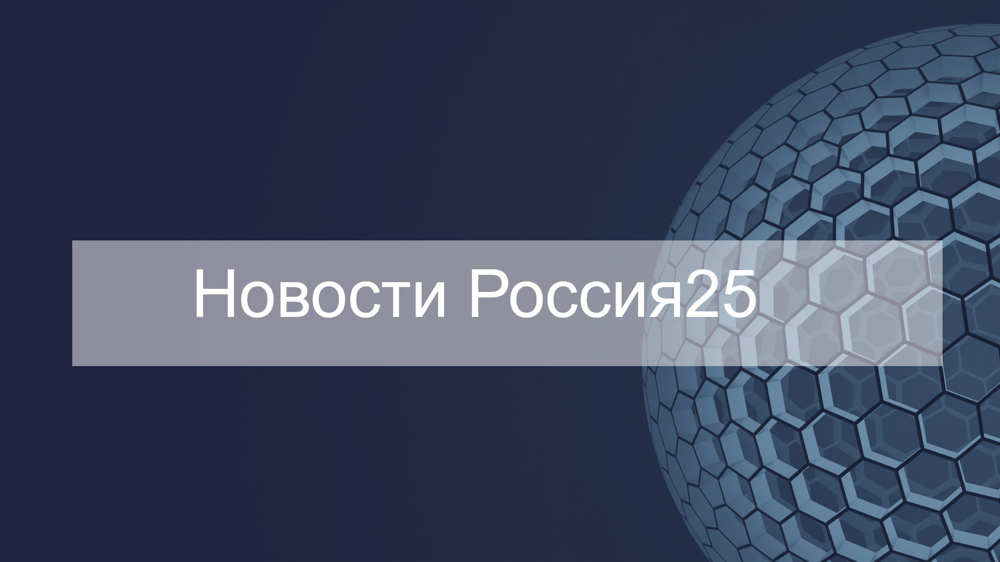

# Проект: Новостной сайт выдуманных новостей "Новости Россия25"
:wave::wave::wave::wave::wave:

## Разработан в качестве практического задания на курсе   "web-разработка" по теме: "CSS"

### Используемые технологии

* HTML

* CSS(bootstrap) 

## Как открыть/запустить

Кликнуть 2 раза по файлу index.html.
